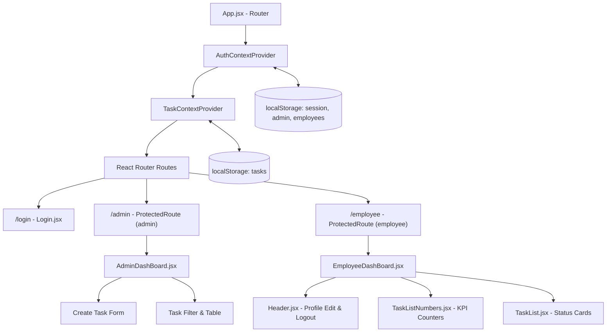

# 🏢 Employee Management System (EMS)

A sleek, modern, and production-ready **Employee Management & Task Tracking Web Application** built with **React 19**, **Vite 8**, **Tailwind CSS v4**, and **React Router v7**. 

Designed with a high-contrast dark aesthetic, role-based access control (Admin & Employee), interactive task workflows, responsive layouts, and seamless client-side data persistence.

---

## 🚀 Live Demo & Repository

- 🌐 **Live Demo**: [employee-management-system-rouge-eight.vercel.app](https://employee-management-system-rouge-eight.vercel.app)
- 📦 **GitHub Repository**: [github.com/AryanTiwari005/Employee-Management-System](https://github.com/AryanTiwari005/Employee-Management-System)

---

## 📸 Key Interfaces

| 👑 Admin Dashboard | 👷 Employee Dashboard |
| :---: | :---: |
| Dynamic task assignment, employee validation & filterable task tables | Task counters, responsive card swipe-board & status actions |

| 🔐 Role-Based Login | ✏️ User Profile Customization |
| :---: | :---: |
| 1-click demo autofill, password toggle & instant validation | Editable display name with persistent local storage |

---

## 🛠️ Tech Stack & Tooling

| Layer | Technology | Description |
| :--- | :--- | :--- |
| **Frontend Framework** | **React 19** (`react`, `react-dom`) | Functional components, custom hooks, and React 19 architecture |
| **Build Tooling** | **Vite 8** (`@vitejs/plugin-react`) | Ultra-fast HMR and optimized production bundling |
| **Styling** | **Tailwind CSS v4** (`@tailwindcss/vite`) | Modern utility-first styling with dark-mode aesthetic |
| **Routing** | **React Router v7** (`react-router-dom`) | Role-based protected routes, redirects, and wildcard fallbacks |
| **State Management** | **React Context API** | Decoupled `AuthContext` and `TaskContext` state layers |
| **Notifications** | **React Hot Toast** | Toast feedback for auth, task mutations, and form validations |
| **Persistence** | **LocalStorage API** | Automated schema hydration, data seeding, and real-time syncing |

---

## ✨ Features

### 🔐 1. Authentication & Security
- **Role-Based Routing**: Strict separation between Admin (`/admin`) and Employee (`/employee`) views.
- **Route Protection**: `ProtectedRoute` guards automatically block unauthenticated sessions and redirect unauthorized role attempts.
- **Demo Quick-Fill**: Single-click buttons to instantly log in as Admin or Employee for evaluation.
- **Session Persistence**: Browser refreshes retain user session and role-specific data.

### 📋 2. Admin Workspace
- **Task Delegation**: Form validation ensures tasks are only dispatched to registered employees.
- **Task Categorization**: Assign category tags (Frontend, Backend, Database, Bug Fix, Security, UI/UX).
- **Task Overview & Filter Grid**: Live task table with filter controls by employee assignee and task status (`New`, `Accepted`, `Completed`, `Failed`).
- **Task Deletion**: Safe deletion with confirmation modal dialog.

### 👷 3. Employee Workspace
- **KPI Metrics Header**: Instant summary cards showing counts of New, Accepted, Completed, and Failed tasks.
- **Interactive Task Lifecycle**:
  - **New Tasks**: Accept or acknowledge assignments.
  - **Accepted Tasks**: Mark tasks as Completed or Flag as Failed.
  - **Completed & Failed**: Color-coded status cards.
- **Profile Customization**: Inline display name editor with live updates.

---

## 🔑 Demo Credentials

The application automatically seeds `localStorage` on initial launch with pre-configured accounts:

### 👑 Admin Account
- **Email**: `admin@example.com`
- **Password**: `123`
- **Role**: `Admin` $\rightarrow$ Routes to `/admin`

### 👷 Employee Accounts
| Name | Email | Password | Role | Initial Tasks |
| :--- | :--- | :--- | :--- | :---: |
| **Aryan** | `tiwariaryan.2005@gmail.com` | `Aryan@2005` | Employee | 5 |
| **Sneha** | `employee2@example.com` | `123` | Employee | 4 |
| **Rahul** | `employee3@example.com` | `123` | Employee | 4 |
| **Priya** | `employee4@example.com` | `123` | Employee | 4 |
| **Karan** | `employee5@example.com` | `123` | Employee | 4 |

---

## 🏗️ Architecture & State Flow



---

## 📂 Project Structure

```
employee-management-system/
├── public/                      # Static assets & favicon
├── src/
│   ├── components/
│   │   ├── Auth/
│   │   │   ├── Login.jsx              # Login screen with demo autofill
│   │   │   └── ProtectedRoute.jsx     # Role-based route guard
│   │   ├── DashBoard/
│   │   │   ├── AdminDashBoard.jsx     # Admin management console
│   │   │   └── EmployeeDashBoard.jsx  # Employee portal
│   │   ├── TaskList/
│   │   │   ├── AcceptTask.jsx         # Card for accepted tasks
│   │   │   ├── CompleteTask.jsx       # Card for completed tasks
│   │   │   ├── FailedTask.jsx         # Card for failed tasks
│   │   │   ├── NewTask.jsx            # Card for new incoming tasks
│   │   │   └── TaskList.jsx           # Horizontal card container
│   │   └── other/
│   │       ├── Header.jsx             # Header with username customization
│   │       └── TaskListNumbers.jsx    # Metric counter cards
│   ├── context/
│   │   ├── AuthContext.jsx            # Auth state & session handler
│   │   ├── TaskContext.jsx            # Task CRUD state & dispatchers
│   │   ├── auth-context.js            # Auth context hook & instance
│   │   └── task-context.js            # Task context hook & instance
│   ├── utils/
│   │   └── localStorage.jsx           # Seed data & storage initializers
│   ├── App.jsx                        # Application root, routing & toast provider
│   ├── index.css                      # Tailwind base directives & root styles
│   └── main.jsx                       # React DOM entry point
├── package.json
├── vite.config.js
└── README.md
```

---

## 💻 Local Development

### 1. Prerequisites
- [Node.js](https://nodejs.org/) (v18.0.0 or later)
- [npm](https://www.npmjs.com/) (v9.0.0 or later)

### 2. Clone & Install
```bash
# Clone the repository
git clone https://github.com/your-username/employee-management-system.git

# Navigate into project directory
cd employee-management-system

# Install dependencies
npm install
```

### 3. Run Development Server
```bash
npm run dev
```
Open [http://localhost:5173](http://localhost:5173) in your browser.

### 4. Build for Production
```bash
# Run ESLint validation
npm run lint

# Compile production bundle
npm run build

# Preview production build locally
npm run preview
```

---

## 🚢 Deployment Guide (Vercel)

1. Push your code to a GitHub repository:
   ```bash
   git remote add origin https://github.com/<your-username>/employee-management-system.git
   git branch -M main
   git push -u origin main
   ```
2. Go to [Vercel](https://vercel.com/) and click **"Add New Project"**.
3. Import your GitHub repository.
4. Framework Preset: **Vite**
5. Root Directory: `./`
6. Click **Deploy**. Vercel will automatically build and serve the application using the included `vercel.json` rewrite configuration.

---

## 📜 License
This project is open-source and available under the [MIT License](LICENSE).
